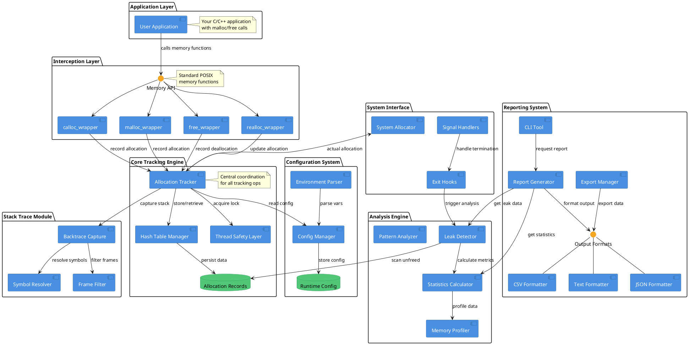
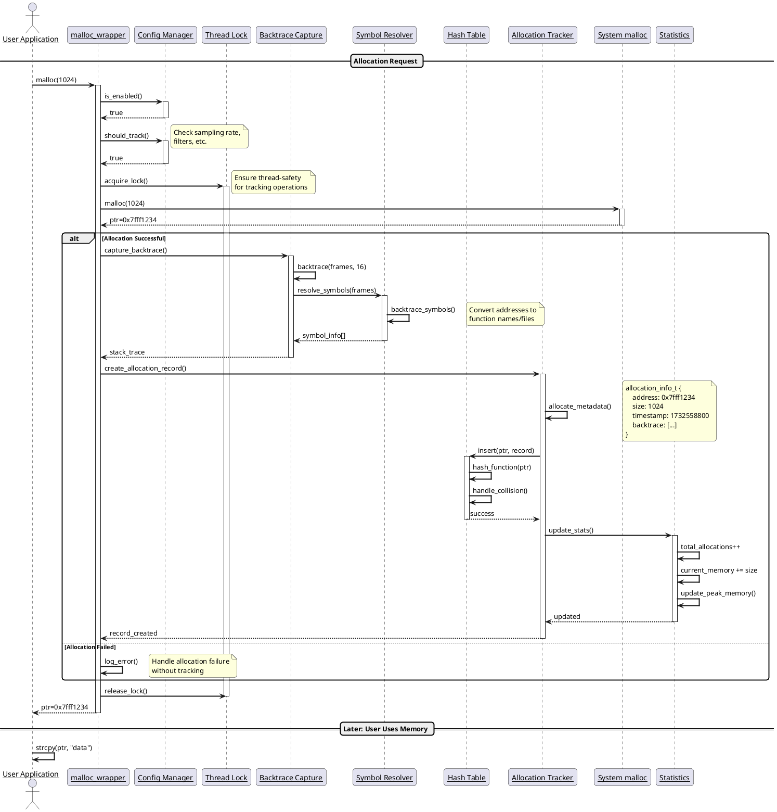
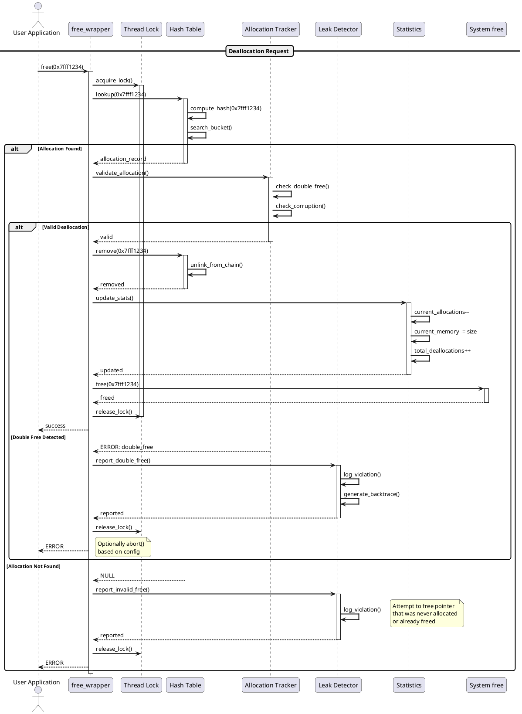
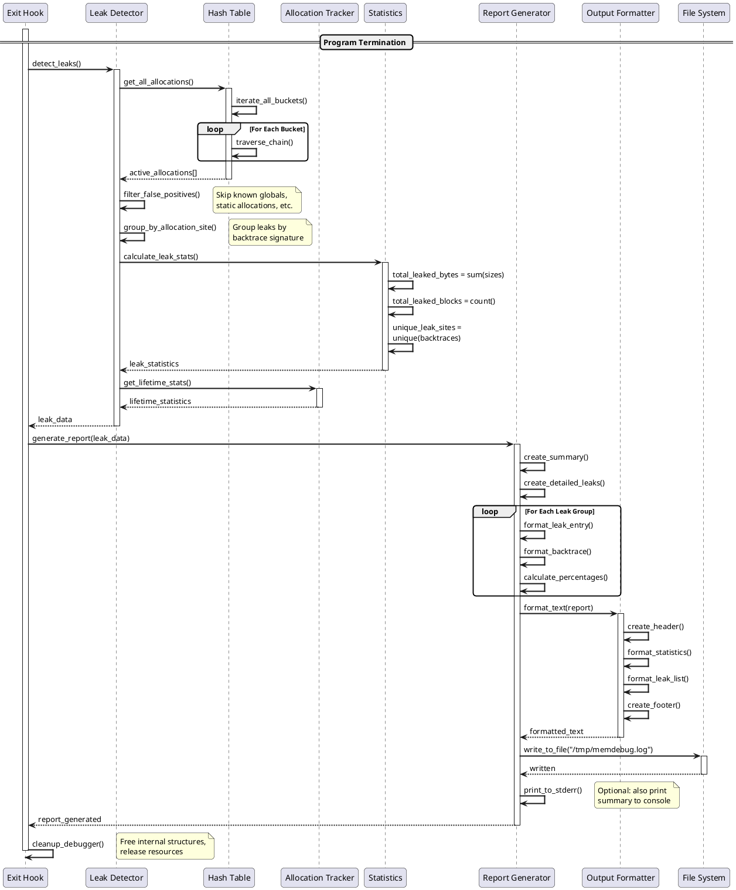
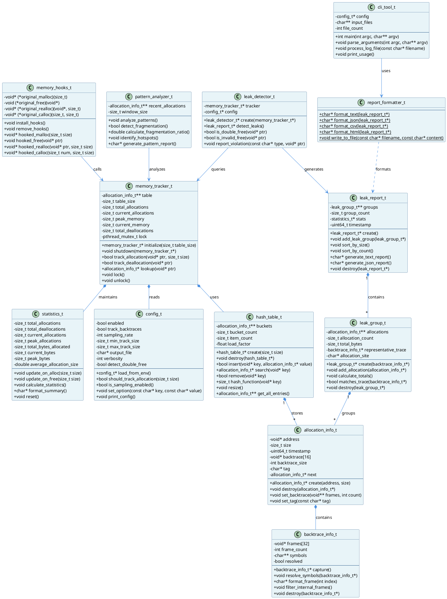
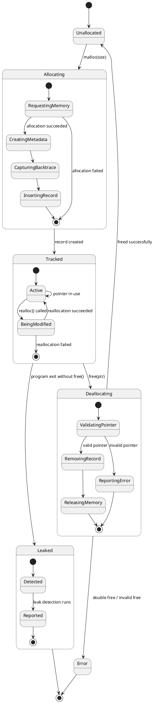
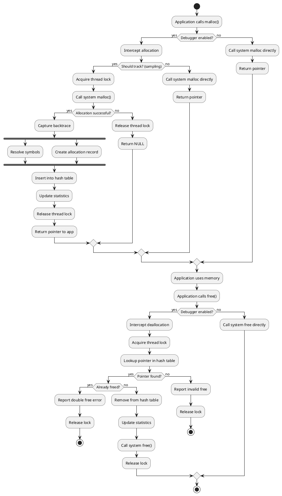

# Based on the thread of ideas collection, which is attached in this space, I picked idea "26. Custom Memory Debugger - Tracks allocations and detects leaks."

- Give me a solid Analysis and Design for this project to implement it
- suggest the language and project architecture, and tell me which scale this project should be in the first phase of development, and future enhancements
- This project should be used in real use cases, not an unused implementation!
- Finally, This Project will be built incrementally as I want to add features per feature until I finish the first phase of it.

Based on your project selection and research into modern memory debugging approaches, here's a comprehensive analysis and design for your Custom Memory Debugger:

***

# **Custom Memory Debugger: Analysis \& Design Document**

## **1. Project Overview**

### **1.1 Problem Statement**

Memory leaks and improper memory management remain critical issues in systems programming, leading to:

- Application crashes and undefined behavior
- Performance degradation over time
- Resource exhaustion in long-running services
- Difficult-to-debug production issues


### **1.2 Solution Approach**

Build a **lightweight, production-ready memory debugging library** that intercepts memory allocation/deallocation calls, tracks allocations, and provides real-time leak detection and analysis capabilities.

***

## **2. Language \& Technology Selection**

### **2.1 Primary Implementation: C/C++**

**Why C/C++?**

- Direct control over memory management primitives
- Ability to intercept `malloc/free/new/delete` through various techniques
- Zero-overhead abstractions when needed
- Most real-world memory issues occur in C/C++ codebases
- Performance-critical applications require minimal instrumentation overhead

**Alternative consideration:** Rust (for future versions with memory-safe implementation)

### **2.2 Interception Techniques**

1. **Library Preloading (`LD_PRELOAD`)** - Primary method for Unix/Linux
2. **Compile-time Instrumentation** - Using compiler hooks/attributes
3. **Link-time Wrapping** - Using `--wrap` linker flags

***

## **3. Architecture Design**

### **3.1 Core Components**

```
┌─────────────────────────────────────────────────┐
│          Application Code                        │
│  (malloc, free, new, delete calls)              │
└──────────────┬──────────────────────────────────┘
               │
               ▼
┌─────────────────────────────────────────────────┐
│     Interception Layer (Hooks)                   │
│  - malloc_wrapper()                              │
│  - free_wrapper()                                │
│  - new/delete operators                          │
└──────────────┬──────────────────────────────────┘
               │
               ▼
┌─────────────────────────────────────────────────┐
│     Allocation Tracker (Core Engine)             │
│  - Hash table for active allocations             │
│  - Stack trace capture                           │
│  - Metadata storage                              │
└──────────────┬──────────────────────────────────┘
               │
               ▼
┌─────────────────────────────────────────────────┐
│     Analysis Engine                              │
│  - Leak detection algorithms                     │
│  - Memory usage statistics                       │
│  - Fragmentation analysis                        │
└──────────────┬──────────────────────────────────┘
               │
               ▼
┌─────────────────────────────────────────────────┐
│     Reporting Interface                          │
│  - CLI output formatter                          │
│  - JSON/CSV export                               │
│  - Real-time monitoring hooks                    │
└─────────────────────────────────────────────────┘
```


### **3.2 Data Structures**

**Allocation Record:**

```c
typedef struct allocation_info {
    void* address;              // Allocated memory address
    size_t size;               // Allocation size in bytes
    uint64_t timestamp;        // Allocation timestamp
    void* backtrace[^1_16];       // Stack trace at allocation
    int backtrace_size;        // Number of stack frames
    const char* tag;           // Optional user tag
    struct allocation_info* next;  // For hash collision chaining
} allocation_info_t;
```

**Tracker State:**

```c
typedef struct memory_tracker {
    allocation_info_t** table;     // Hash table
    size_t table_size;             // Hash table size
    size_t total_allocations;      // Lifetime allocation count
    size_t current_allocations;    // Active allocations
    size_t peak_memory;            // Peak memory usage
    size_t current_memory;         // Current memory usage
    pthread_mutex_t lock;          // Thread-safety lock
} memory_tracker_t;
```


***

## **4. Phase 1: Minimal Viable Product (MVP)**

### **4.1 Scope \& Timeline: 6-8 weeks**

### **4.2 Core Features**

#### **Feature 1: Basic Allocation Tracking** (Week 1-2)

- Intercept `malloc`, `calloc`, `realloc`, `free`
- Store allocation metadata (address, size, timestamp)
- Implement hash table for O(1) lookup
- Thread-safe operations using mutexes

**Deliverable:** Library that can be preloaded to track allocations

#### **Feature 2: Stack Trace Capture** (Week 2-3)

- Capture call stack at allocation time using `backtrace()`
- Store function names and line numbers
- Implement symbol resolution using `backtrace_symbols()`

**Deliverable:** Allocations with full stack trace information

#### **Feature 3: Leak Detection** (Week 3-4)

- Identify unfreed allocations at program exit
- Detect double-free attempts
- Report invalid free operations

**Deliverable:** Leak report generation at exit

#### **Feature 4: CLI Reporting Tool** (Week 4-5)

- Summary statistics (total leaks, memory usage)
- Grouped leak reports by allocation site
- Human-readable output format

**Deliverable:** `memdebug-report` CLI tool

#### **Feature 5: Configuration System** (Week 5-6)

- Environment variable configuration
- Enable/disable features at runtime
- Sampling mode (track every Nth allocation)
- Output verbosity levels

**Deliverable:** Flexible configuration via `MEMDEBUG_*` env vars

#### **Feature 6: Documentation \& Testing** (Week 6-8)

- User documentation and examples
- Test suite with known leak scenarios
- Performance benchmarks
- Integration examples

**Deliverable:** Complete documentation and test coverage

### **4.3 MVP Success Criteria**

✅ Successfully detects memory leaks with <5% performance overhead
✅ Accurate stack trace reporting
✅ Thread-safe operation in multi-threaded applications
✅ Zero false positives in test suite
✅ Clear, actionable reports

***

## **5. Real-World Use Cases**

### **5.1 Development Phase**

- **Local Testing:** Developers run applications with debugger enabled
- **CI/CD Integration:** Automated leak detection in test pipelines
- **Code Review:** Verify memory management before merging


### **5.2 Production Monitoring**

- **Sampling Mode:** Low-overhead monitoring (1% sampling rate)
- **Periodic Reports:** Daily/weekly leak analysis
- **Alert Integration:** Trigger alerts when leaks detected


### **5.3 Practical Applications**

1. **Web Servers:** Detect leaks in long-running HTTP servers (nginx modules, custom servers)
2. **Database Engines:** Track memory in query executors and storage engines
3. **Game Engines:** Monitor memory during gameplay sessions
4. **Embedded Systems:** Lightweight tracking for resource-constrained devices
5. **System Utilities:** Debug custom allocators in OS components

***

## **6. Implementation Strategy**

### **6.1 Incremental Development Plan**

**Sprint 1 (Weeks 1-2): Foundation**

```
Tasks:
- Set up build system (CMake/Meson)
- Implement basic malloc/free interception
- Create hash table for allocation tracking
- Add thread synchronization primitives
- Write unit tests for core data structures

Deliverable: Can intercept and log allocations
```

**Sprint 2 (Weeks 2-3): Stack Traces**

```
Tasks:
- Integrate backtrace() functionality
- Implement symbol resolution
- Handle edge cases (stripped binaries)
- Add frame filtering (skip debugger frames)
- Test with various optimization levels

Deliverable: Full call stack for each allocation
```

**Sprint 3 (Weeks 3-4): Leak Detection**

```
Tasks:
- Implement exit handler for leak reporting
- Detect double-free scenarios
- Add invalid free detection
- Group leaks by allocation site
- Calculate leak statistics

Deliverable: Comprehensive leak reports
```

**Sprint 4 (Weeks 4-5): Reporting**

```
Tasks:
- Design output format (text/JSON)
- Implement CLI tool for report generation
- Add filtering and sorting options
- Create summary statistics
- Generate per-file leak breakdown

Deliverable: Professional reporting tool
```

**Sprint 5 (Weeks 5-6): Configuration**

```
Tasks:
- Environment variable parsing
- Sampling mode implementation
- Runtime enable/disable toggles
- Output destination configuration
- Performance profiling

Deliverable: Configurable debugger library
```

**Sprint 6 (Weeks 6-8): Polish \& Release**

```
Tasks:
- Write comprehensive documentation
- Create example projects
- Build test suite (100+ test cases)
- Performance optimization
- Package for distribution

Deliverable: Production-ready v1.0
```


### **6.2 Development Workflow**

```
For each feature:
1. Write design doc (30 min)
2. Implement core logic (4-8 hours)
3. Add unit tests (2-4 hours)
4. Integration testing (2 hours)
5. Documentation (1 hour)
6. Code review & refinement (1-2 hours)
```


***

## **7. Future Enhancements (Post-Phase 1)**

### **7.1 Phase 2: Advanced Features** (2-3 months)

- **C++ Support:** New/delete operators, smart pointer tracking
- **Memory Pattern Analysis:** Detect fragmentation patterns
- **Heap Visualization:** Generate memory layout diagrams
- **Custom Allocator Support:** Track pool allocators and arenas
- **Real-time Dashboard:** Web-based monitoring interface


### **7.2 Phase 3: Production Hardening** (2-3 months)

- **Minimal Overhead Mode:** <1% performance impact
- **Distributed Tracing:** Integration with OpenTelemetry
- **Machine Learning:** Anomaly detection for leak patterns
- **Kernel Integration:** Track kernel-level allocations
- **Platform Expansion:** Windows support (Detours API)


### **7.3 Phase 4: Ecosystem** (3-6 months)

- **IDE Plugins:** VSCode, CLion integration
- **Language Bindings:** Python, Ruby, Node.js wrappers
- **Cloud Integration:** AWS Lambda, Kubernetes support
- **Commercial Features:** Enterprise reporting, compliance tools

***

## **8. Technical Specifications**

### **8.1 Performance Targets**

- **Overhead:** <5% slowdown in typical applications
- **Memory:** <10MB additional memory usage
- **Latency:** <100μs per allocation in tracking mode
- **Throughput:** Handle 1M+ allocations/second


### **8.2 Compatibility**

- **OS:** Linux (primary), macOS, *BSD
- **Compilers:** GCC 7+, Clang 10+, ICC
- **Architectures:** x86-64, ARM64, RISC-V
- **Standards:** C11, C++17


### **8.3 Dependencies**

- **Minimal:** Only POSIX APIs and libc
- **Optional:** libunwind (better stack traces), libdw (DWARF debugging)

***

## **9. Project Structure**

```
memdebug/
├── src/
│   ├── core/
│   │   ├── tracker.c          # Core tracking engine
│   │   ├── hashtable.c        # Hash table implementation
│   │   └── allocator.c        # Allocation hooks
│   ├── backtrace/
│   │   ├── capture.c          # Stack capture
│   │   └── resolve.c          # Symbol resolution
│   ├── analysis/
│   │   ├── leaks.c            # Leak detection
│   │   └── stats.c            # Statistics generation
│   └── report/
│       ├── formatter.c        # Output formatting
│       └── exporter.c         # Data export
├── include/
│   └── memdebug.h             # Public API
├── tools/
│   └── memdebug-report.c      # CLI tool
├── tests/
│   ├── unit/                  # Unit tests
│   └── integration/           # Integration tests
├── examples/
│   ├── basic_leak.c           # Simple example
│   └── multithreaded.c        # Threading example
├── docs/
│   ├── API.md                 # API documentation
│   ├── USAGE.md               # Usage guide
│   └── INTERNALS.md           # Implementation details
├── CMakeLists.txt             # Build configuration
└── README.md                  # Project overview
```


***

## **10. Getting Started (Quick Start for Users)**

### **10.1 Installation**

```bash
# Build from source
git clone https://github.com/yourteam/memdebug.git
cd memdebug
mkdir build && cd build
cmake ..
make
sudo make install
```


### **10.2 Basic Usage**

```bash
# Preload the library
LD_PRELOAD=/usr/local/lib/libmemdebug.so ./your_app

# Generate report
memdebug-report /tmp/memdebug-*.log
```


### **10.3 Configuration**

```bash
# Enable full tracking
export MEMDEBUG_ENABLED=1

# Set sampling rate (track 10% of allocations)
export MEMDEBUG_SAMPLE_RATE=10

# Output file
export MEMDEBUG_OUTPUT=/tmp/memdebug.log

# Enable stack traces
export MEMDEBUG_BACKTRACE=1
```


***

## **11. Success Metrics**

### **11.1 Technical Metrics**

- ✅ 100% test coverage for core functions
- ✅ Zero memory leaks in debugger itself
- ✅ <5% performance overhead
- ✅ Support for 1M+ simultaneous tracked allocations


### **11.2 Adoption Metrics**

- 🎯 Used in at least 3 internal projects
- 🎯 10+ GitHub stars within first month
- 🎯 Positive feedback from team members
- 🎯 Integration into CI/CD pipelines

***

## **12. Risk Mitigation**

### **12.1 Technical Risks**

| Risk | Impact | Mitigation |
| :-- | :-- | :-- |
| Performance overhead too high | High | Implement sampling mode, lazy initialization |
| Thread safety issues | Critical | Comprehensive locking strategy, stress testing |
| Platform compatibility | Medium | Focus on Linux first, test on multiple distros |
| False positives | High | Rigorous testing, conservative leak detection |

### **12.2 Project Risks**

| Risk | Impact | Mitigation |
| :-- | :-- | :-- |
| Feature creep | Medium | Strict scope for Phase 1, defer enhancements |
| Time overruns | Medium | Weekly progress reviews, buffer in timeline |
| Lack of adoption | Low | Early demos, clear documentation |


***

## **13. Conclusion**

This Custom Memory Debugger project provides:
✅ **Practical value:** Solves real memory management problems
✅ **Learning opportunity:** Deep dive into systems programming
✅ **Incremental delivery:** Clear weekly milestones
✅ **Production readiness:** Designed for real-world use
✅ **Future potential:** Clear roadmap for enhancements

**Start Date:** February 2025
**Phase 1 Completion:** Mid-March 2025 (6-8 weeks)
**First Real Usage:** Week 9 (dogfooding in team projects)

The project strikes the perfect balance between complexity and achievability, providing immediate value while building toward a comprehensive memory debugging solution.

***


---

# Great, Remake the Architecture Design for Components, Sequence and Class Diagrams in .puml codes.

Here are comprehensive PlantUML diagrams for the Custom Memory Debugger architecture:

***

## **1. Component Diagram**




***

## **2. Sequence Diagram: Memory Allocation Flow**




***

## **3. Sequence Diagram: Memory Deallocation Flow**




***

## **4. Sequence Diagram: Leak Detection at Exit**




***

## **5. Class Diagram**




***

## **6. State Diagram: Allocation Lifecycle**




***

## **7. Activity Diagram: Complete Tracking Workflow**




***

These PlantUML diagrams provide a complete visual representation of your Custom Memory Debugger architecture. You can render them using:

1. **Online:** [PlantUML Online Editor](http://www.plantuml.com/plantuml/)
2. **IDE Plugins:** VSCode PlantUML extension, IntelliJ IDEA PlantUML integration
3. **CLI:** `plantuml diagram.puml` (requires Java + PlantUML jar)
4. **Documentation:** Integrate directly into Markdown with rendering tools

Each diagram serves a specific purpose:

- **Component:** System architecture overview
- **Sequence (3 variants):** Detailed runtime behavior
- **Class:** Code structure and relationships
- **State:** Allocation lifecycle
- **Activity:** End-to-end workflow

Ready to start implementing Sprint 1? 🚀

